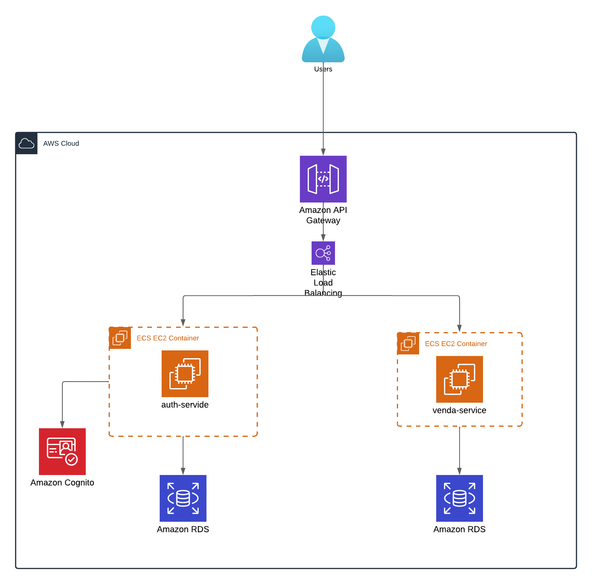
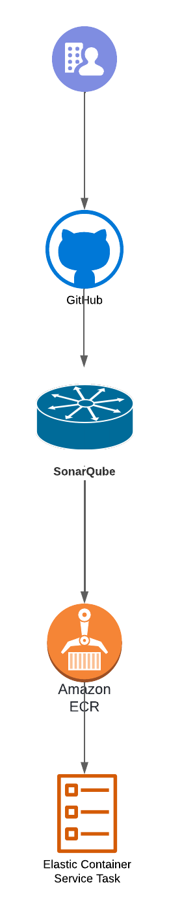

# Revenda de veiculos
## Diagrama de Arquitetura

## Visão Geral

O projeto **Revenda de veiculos** consiste em dois microserviços principais: **Venda** e **Autorização**.

### Microserviço de Autorização

O microserviço de autorização é responsável por:

- **Cadastro de Usuários**: Integra-se com o Amazon Cognito para autenticação e controle de acesso dos usuários.

### Microserviço de Venda

O microserviço de venda tem como função:

- **Cadastro de Veiculos**: Possibilita que um usuário autenticado possa cadastrar e editar um veiculo.
- **Listagem de Veiculos**: Possibilita que um usuário autenticado listar os seus veiculos vendidos e os veiculos que estão a venda.
- **Compra de Veiculos**: Possibilita que um usuário autenticado possa comprar um veiculo que esta a venda.

## Deploy e CI/CD

O deploy das aplicações é realizado através do **GitHub Actions**. As Pull Requests (PRs) não direcionadas à branch **main**. A partir dessas validações, uma imagem é gerada no **Amazon ECR** e o deploy é realizado através de uma **Service Task** no **Amazon ECS**.
